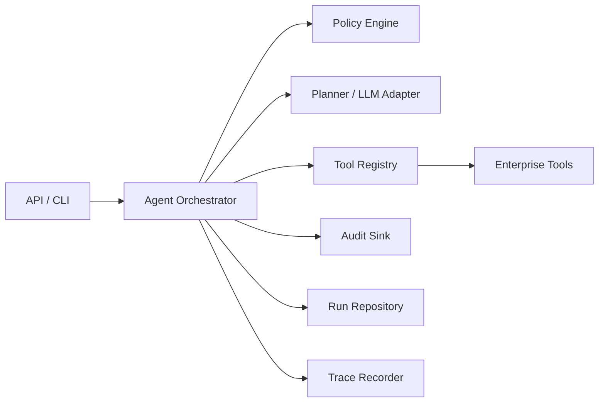

# 架构说明

## 设计目标

该项目面向企业内部 AI Agent 落地场景，核心目标是让 Agent 能被治理、审计、观测和扩展，而不是只完成一次性对话。

## 核心链路

## 模块职责

- **API / CLI**：接收外部请求，转换为领域模型。
- **Agent Orchestrator**：负责一次 Agent Run 的生命周期，包括策略检查、计划生成、工具执行和结果汇总。
- **Policy Engine**：判断角色、风险等级、工具权限和危险指令。
- **Tool Registry**：集中注册企业工具，并声明工具风险等级、输入契约和允许角色。
- **LLM Adapter**：隔离模型供应商，支持规则规划器、OpenAI、私有模型或企业模型网关。
- **Audit Sink**：记录用户、角色、请求、工具调用和策略决策，便于合规追踪。
- **Trace Recorder**：记录 step latency、status 和错误信息，便于排障和性能分析。

## 企业化能力

1. 策略先行：工具执行前必须通过策略检查。
2. 可回放：每次运行保存输入、计划、工具输出和最终结果。
3. 可替换模型：业务逻辑不依赖具体 LLM SDK。
4. 最小权限：工具声明允许角色，高风险工具默认只允许管理员。
5. 离线可演示：没有模型 Key 时仍可以完整跑通项目。
